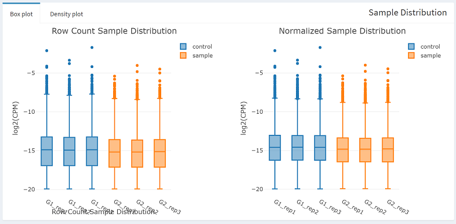
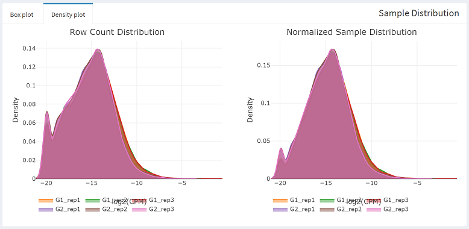

# Steps for calculation
---

1. Click `[Calculation]` tab in the side bar on the left of this page.   
    
2. You can change all the parameters of TCC calculation or just leave it as default. Click `[Run TCC Calculation]` button and wait for calculation finished. Depends on your size of dataset, method you have chosen and the iteration number, it will take several seconds to 2 minutes for calculation (`WAD` < `voom` < Others ).  
    
3. After calculation, `[Result Table]` will show on the right of the page. `[Sample Distribution]` of before normalization and after will be drawn simultaneously.  
    
    
  Besides, you can copy and save the **R code of TCC calculation** (under `[TCC Parameters]` panel) in the purpose of code studying or reproducing the same results on a local machine.   
4. Next, **Step3** & **Step4** tabs will show up in the side bar. **Step3** is for data exploration, visualization and analysis while **Step4** is for outputs. you can choose any of them for the next step of your analysis.    
