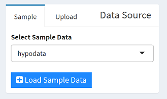
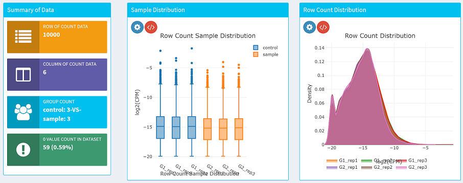

# Steps for data import
---
1. First, click **`Data Import (Step 1)`** tab in the side bar on the left of this page.  
    
2. At the left of the top, you can `[Import Data]` just for a test, or click `[Upload]` data tab for uploading your own `tab-delimited text file` like [hypodata.txt](http://www.iu.a.u-tokyo.ac.jp/~kadota/R_seq/data_hypodata_3vs3.txt). Please make sure it's a original `count data` file. If you are going to upload large dataset (such as file in 50,000 rows when using online version TCC-GUI), please wait until the file has been uploaded completely. In this case, offline version is highly recommended.   
    
  Data will be shown after loaded.  
    
3. After the dataset loaded, input your grouping into the `[Group Selection]` panel. 
   - First column is your sample name (the same as the column's name of your input dataset), only the columns which are listed at here will be included into analysis.   
   - Second column is your grouping name (such as "control" or "sample")  
       
4. Click `[Confirmed]` button, wait for a while, and the `[Summary of Data]` and `[Sample Distribution]` will show more information of your dataset. You can modify the plot and save them for the purpose of studying or publishing.  
    
