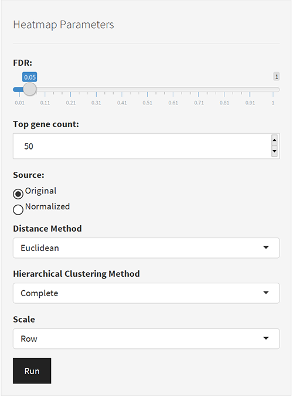
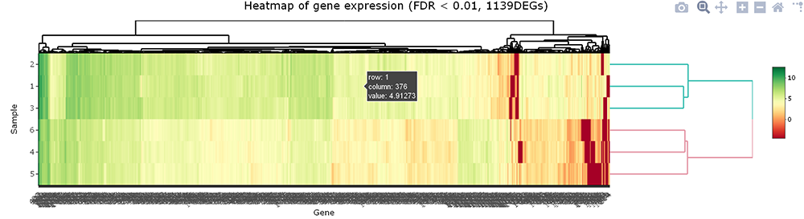
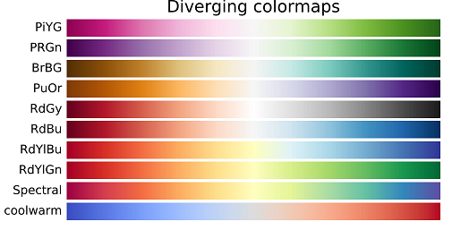

1. You can select genes by two method, **By list** and **By FDR**.  
  - **By list**: Input a list of genes' name those you want it to be shown in heatmap.  
  - **By FDR**: Use FDR cut off and the top ***N*** genes to generate heatmap.  

      
2. Change the parameters for heatmap (if you wish).  
   Click the `[Run heatmap]` button, and the result will show up on the right.  

        

3. How to change the color in heatmap?
   In `Choose colormap`, select a color map and the `number of colors` you prefer to use in the heatmap.  

