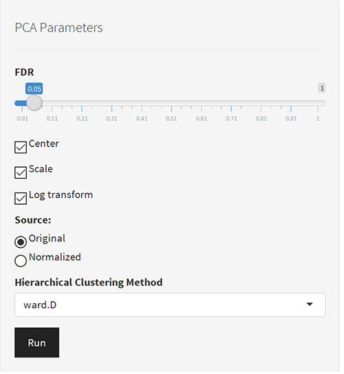
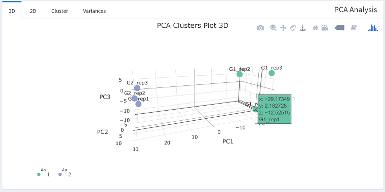
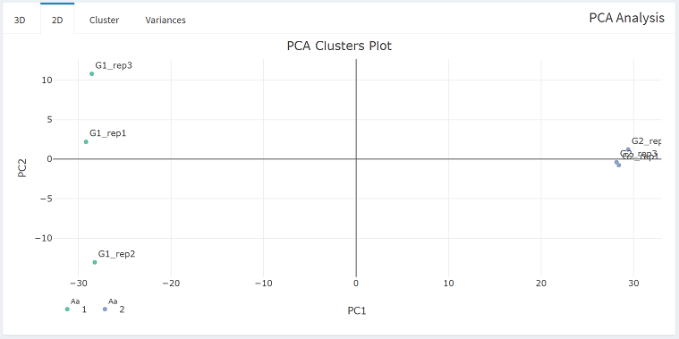
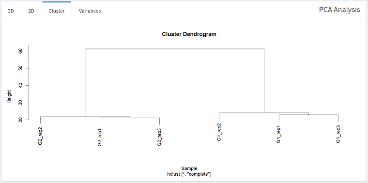
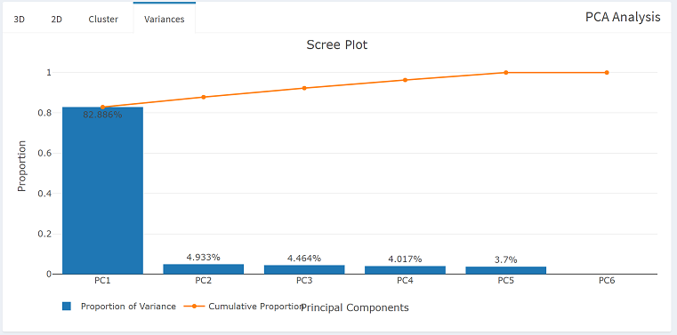

1. Change the parameters for PCA (if you wish), and click the **[Run]** button.  
    
2. There are four plots provided:  
    - 3D  
        
    - 2D  
        
    - Cluster  
        
    - Variances  
        
