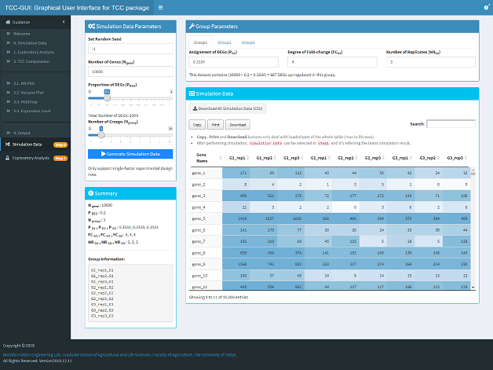

# Simulation Data  

In **Simulation Data**, the GUI version of `simulateReadCounts` function to generate simulation data generated based on various parameters will be used here. 

You can set the random seed, number of genes (*Ngene*), Proportion of DEGs (*PDEG*) and the number of groups (*Ngroup*). According to the specific *Ngroup* value, tabs in the ***Group parameters*** will change in order to ensure the consistency. The caption of number of DEGs at the bottom of this panel and the ***Summary*** panel will keep real-time updating based on all parameters to speed-up the analysis. 

Besides *Ngene*, *PDEG* and *Ngroup*, other information will be shown in ***Summary*** panel are:

- *PGi*: The assignment of DEGs in group *i* (*i* = 1, 2... *Ngroup*). 
- *FCGi*: Degree of fold-change in group *i* (*i* = 1, 2... *Ngroup*).
- *NRGi*: Number of replicates in group *i* (*i* = 1, 2... *Ngroup*).

After  the **Generate Simulation Data** button  is clicked, the dataset will be generated within several seconds based on all  parameters and the result will be displayed in the ***Simulation Data*** panel and  the values will be colored from white to dark blue  according to the expression values from low to high. Users can download the  dataset to their local machine or just click the "Exploratory Analysis (Step  1)" to conduct various analysis directly. 
