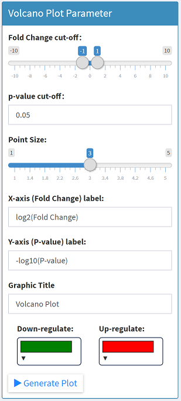

# 🤔What's Volcano Plot?
---
In statistics, a volcano plot is a type of scatter-plot that is used to quickly identify changes in large data sets composed of replicate data. It plots `significance` versus `fold-change` on the `y` and `x` axes, respectively. These plots are increasingly common in omic experiments such as genomics, proteomics, and metabolomics where one often has a list of many thousands of replicate data points between two conditions and one wishes to quickly identify the most meaningful changes (quote from 🔗[wikipedia](https://en.wikipedia.org/wiki/Volcano_plot_(statistics))).  

# Steps for plotting
---
Almost the same as `[MA Plot]`. Please check the document of MA Plot.  

  
  
