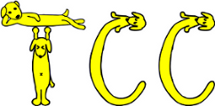

# 🤔What's TCC?  

---

**[TCC](http://bioconductor.org/packages/TCC/)**^[1] is a [R](https://www.r-project.org/)/[Bioconductor](https://www.bioconductor.org/) package provides a series of functions for performing differential expression  (**DE**)  analysis from RNA-seq count data using a robust normalization strategy (called **DEGES**).  

The basic idea of **DEGES** is that potential differentially expressed genes (**DEGs**) among compared samples should be removed before data normalization to obtain a well-ranked gene list where true **DEGs** are top-ranked and **non-DEGs** are bottom ranked. This can be done by performing the multi-step normalization procedures based on **DEGES** (**DEG elimination strategy**) implemented in TCC.  

TCC internally uses functions provided by **edgeR**^[2], **DESeq2**^[3], and **baySeq**^[4] . The multi-step normalization of TCC can be done by using functions in the four packages.  

## 🔬TCC-GUI: Graphical User Interface for TCC package

---
In this **GUI version of TCC (TCC-GUI)**, all parameter settings are available just like you are using the original one. Besides, it also provides lots of plotting functions where the original package is unsupported now.  

## 🛠Function

- Generalization of Simulation data .
- Dataset `summarization` and sample `distribution plot` for sample quality control.
- Detection of differentially expressed genes (DEGs).
- Interactive visualization of `MA plot`, `Volcano plot`, `expression level plot` and so on.
- `PCA` and `heatmap` analysis (clustering included).
- Output result in table, figure, code or report (.md, .pdf) (Under developing).

Please check other tab in `Guidance` for details.  

## 📧Contact

---

If you have any question about the application, comment and advise, please contact 📧[koji.kadota(at)gmail.com](mailto:koji.kadota@gmail.com) or 📧[swsoyee(at)gmail.com](mailto:swsoyee@gmail.com).  

Also, you can access 🔗[Github](https://github.com/swsoyee/TCC-GUI/issues) and open a new issue for bug report or function requirement (you can write in English, Chinese or Japanese as you like).  

## 📚References

---

[1] Sun J, Nishiyama T, Shimizu K, et al. **TCC**: an R package for comparing tag count data with robust normalization strategies. BMC bioinformatics, 2013, 14(1): 219.  
[2] Robinson M D, McCarthy D J, Smyth G K. **edgeR**: a Bioconductor package for differential expression analysis of digital gene expression data. Bioinformatics, 2010, 26(1): 139-140.  
[3] Love M I, Huber W, Anders S. Moderated estimation of fold change and dispersion for RNA-seq data with **DESeq2**. Genome biology, 2014, 15(12): 550.  
[4] Hardcastle T J, Kelly K A. **baySeq** : empirical Bayesian methods for identifying differential expression in sequence count data. BMC bioinformatics, 2010, 11(1): 422.  

🔗Emoji icons supplied by [EmojiOne](https://www.emojione.com/)  
