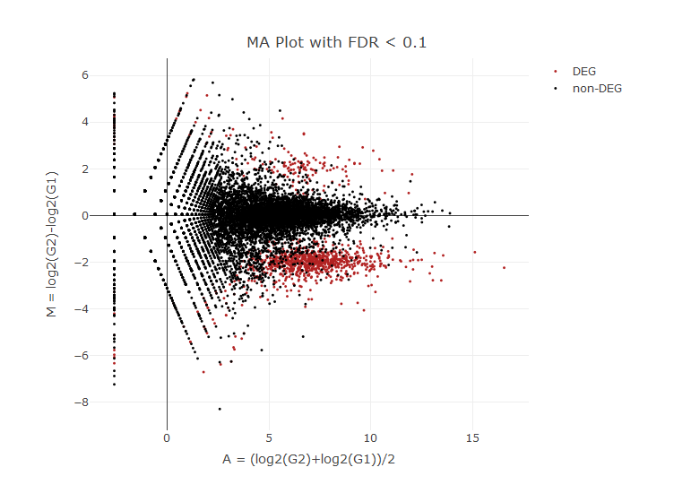

Report workflow
---------------

Developing now…

### 0. Setting and read file.

#### Input Count Data:

<table>
<thead>
<tr class="header">
<th></th>
<th style="text-align: right;">G1_rep1</th>
<th style="text-align: right;">G1_rep2</th>
<th style="text-align: right;">G1_rep3</th>
<th style="text-align: right;">G2_rep1</th>
<th style="text-align: right;">G2_rep2</th>
<th style="text-align: right;">G2_rep3</th>
</tr>
</thead>
<tbody>
<tr class="odd">
<td>gene_1</td>
<td style="text-align: right;">36</td>
<td style="text-align: right;">56</td>
<td style="text-align: right;">144</td>
<td style="text-align: right;">2</td>
<td style="text-align: right;">1</td>
<td style="text-align: right;">0</td>
</tr>
<tr class="even">
<td>gene_2</td>
<td style="text-align: right;">84</td>
<td style="text-align: right;">152</td>
<td style="text-align: right;">124</td>
<td style="text-align: right;">52</td>
<td style="text-align: right;">37</td>
<td style="text-align: right;">28</td>
</tr>
<tr class="odd">
<td>gene_3</td>
<td style="text-align: right;">592</td>
<td style="text-align: right;">840</td>
<td style="text-align: right;">800</td>
<td style="text-align: right;">151</td>
<td style="text-align: right;">257</td>
<td style="text-align: right;">200</td>
</tr>
<tr class="even">
<td>gene_4</td>
<td style="text-align: right;">0</td>
<td style="text-align: right;">8</td>
<td style="text-align: right;">4</td>
<td style="text-align: right;">1</td>
<td style="text-align: right;">1</td>
<td style="text-align: right;">3</td>
</tr>
<tr class="odd">
<td>gene_5</td>
<td style="text-align: right;">32</td>
<td style="text-align: right;">32</td>
<td style="text-align: right;">0</td>
<td style="text-align: right;">1</td>
<td style="text-align: right;">1</td>
<td style="text-align: right;">0</td>
</tr>
<tr class="even">
<td>gene_6</td>
<td style="text-align: right;">4</td>
<td style="text-align: right;">0</td>
<td style="text-align: right;">24</td>
<td style="text-align: right;">4</td>
<td style="text-align: right;">10</td>
<td style="text-align: right;">0</td>
</tr>
</tbody>
</table>

    ## Warning in .Method(..., deparse.level = deparse.level): number of columns
    ## of result is not a multiple of vector length (arg 2)

#### Parameter

<table>
<thead>
<tr class="header">
<th style="text-align: left;">Parameter</th>
<th style="text-align: left;">Value</th>
</tr>
</thead>
<tbody>
<tr class="odd">
<td style="text-align: left;">Group info</td>
<td style="text-align: left;">c(“G1_rep1”, “G1_rep2”, “G1_rep3”) VS c(“G2_rep1”, “G2_rep2”, “G2_rep3”)</td>
</tr>
<tr class="even">
<td style="text-align: left;">Filter low count</td>
<td style="text-align: left;">0</td>
</tr>
<tr class="odd">
<td style="text-align: left;">Normalized Method</td>
<td style="text-align: left;">tmm</td>
</tr>
<tr class="even">
<td style="text-align: left;">Test Method</td>
<td style="text-align: left;">voom</td>
</tr>
<tr class="odd">
<td style="text-align: left;">Iteration</td>
<td style="text-align: left;">3</td>
</tr>
<tr class="even">
<td style="text-align: left;">FDR</td>
<td style="text-align: left;">0.1</td>
</tr>
<tr class="odd">
<td style="text-align: left;">Floor DEGs p-value</td>
<td style="text-align: left;">0.05</td>
</tr>
</tbody>
</table>

<table>
<thead>
<tr class="header">
<th style="text-align: left;">Parameter</th>
<th style="text-align: left;">Value</th>
</tr>
</thead>
<tbody>
<tr class="odd">
<td style="text-align: left;">MA-Plot FDR</td>
<td style="text-align: left;">0.1</td>
</tr>
<tr class="even">
<td style="text-align: left;">Color</td>
<td style="text-align: left;">#B22222</td>
</tr>
</tbody>
</table>

<table>
<thead>
<tr class="header">
<th style="text-align: left;">Parameter</th>
<th style="text-align: left;">Value</th>
<th style="text-align: left;">NA</th>
</tr>
</thead>
<tbody>
<tr class="odd">
<td style="text-align: left;">Fold change cutoff</td>
<td style="text-align: left;">-1</td>
<td style="text-align: left;">1</td>
</tr>
<tr class="even">
<td style="text-align: left;">P-value cutoff</td>
<td style="text-align: left;">0.05</td>
<td style="text-align: left;">P-value cutoff</td>
</tr>
<tr class="odd">
<td style="text-align: left;">Down-regulated genes’ color</td>
<td style="text-align: left;">#00FF00</td>
<td style="text-align: left;">Down-regulated genes’ color</td>
</tr>
<tr class="even">
<td style="text-align: left;">Up-regulated genes’ color</td>
<td style="text-align: left;">#FF0000</td>
<td style="text-align: left;">Up-regulated genes’ color</td>
</tr>
<tr class="odd">
<td style="text-align: left;">X lable</td>
<td style="text-align: left;">log2(Fold Change)</td>
<td style="text-align: left;">X lable</td>
</tr>
<tr class="even">
<td style="text-align: left;">Y lable</td>
<td style="text-align: left;">-log10(P-value)</td>
<td style="text-align: left;">Y lable</td>
</tr>
<tr class="odd">
<td style="text-align: left;">Title of volcano plot</td>
<td style="text-align: left;">Volcano Plot</td>
<td style="text-align: left;">Title of volcano plot</td>
</tr>
</tbody>
</table>

### 1. Processing

Creat TCC Object.

    # Get count data table
    data <- params$CountData

    # Get group information
    data.cl <- rep(0, ncol(data))
    convert2cl <- function(x, df) {
      grep(x, colnames(df))
    }

    # Covert group information format
    for (i in 1:length(params$groupList)) {
      data.cl[unlist(lapply(params$groupList[[i]], convert2cl, df = data))] = i
    }

    # Creat TCC Object
    tcc <- new("TCC", data[data.cl != 0], data.cl[data.cl != 0])
    # Filter low count genes (if necessary).
    tcc <- filterLowCountGenes(tcc, low.count = params$filterLowCount)
    # Run TCC
    tcc <- calcNormFactors(
      tcc,
      norm.method = params$normMethod,
      test.method = params$testMethod,
      iteration = params$iteration,
      FDR = params$fdr,
      floorPDEG = params$floorpdeg
      )

    ## TCC::INFO: Calculating normalization factors using DEGES

    ## TCC::INFO: (iDEGES pipeline : tmm - [ voom - tmm ] X 3 )

    ## TCC::INFO: Done.

    # Estimate differential genes
    tcc <- estimateDE(tcc,
                      test.method = params$testMethod,
                      FDR = params$fdr)    

    ## TCC::INFO: Identifying DE genes using voom ...
    ## TCC::INFO: Done.

    # Result table
    resultTable <- getResult(tcc, sort = FALSE)
    # Normailized data
    norData <- tcc$getNormalizedData()

    kable(head(resultTable))
    kable(head(norData))

<table>
<thead>
<tr class="header">
<th style="text-align: left;">gene_id</th>
<th style="text-align: right;">a.value</th>
<th style="text-align: right;">m.value</th>
<th style="text-align: right;">p.value</th>
<th style="text-align: right;">q.value</th>
<th style="text-align: right;">rank</th>
<th style="text-align: right;">estimatedDEG</th>
</tr>
</thead>
<tbody>
<tr class="odd">
<td style="text-align: left;">gene_1</td>
<td style="text-align: right;">3.148586</td>
<td style="text-align: right;">-6.2449320</td>
<td style="text-align: right;">0.0013975</td>
<td style="text-align: right;">0.0219132</td>
<td style="text-align: right;">634</td>
<td style="text-align: right;">1</td>
</tr>
<tr class="even">
<td style="text-align: left;">gene_2</td>
<td style="text-align: right;">6.097249</td>
<td style="text-align: right;">-1.5702630</td>
<td style="text-align: right;">0.0031644</td>
<td style="text-align: right;">0.0397023</td>
<td style="text-align: right;">792</td>
<td style="text-align: right;">1</td>
</tr>
<tr class="odd">
<td style="text-align: left;">gene_3</td>
<td style="text-align: right;">8.602170</td>
<td style="text-align: right;">-1.8231549</td>
<td style="text-align: right;">0.0001705</td>
<td style="text-align: right;">0.0051976</td>
<td style="text-align: right;">326</td>
<td style="text-align: right;">1</td>
</tr>
<tr class="even">
<td style="text-align: left;">gene_4</td>
<td style="text-align: right;">1.372382</td>
<td style="text-align: right;">-1.2167155</td>
<td style="text-align: right;">0.7627608</td>
<td style="text-align: right;">0.9561301</td>
<td style="text-align: right;">7930</td>
<td style="text-align: right;">0</td>
</tr>
<tr class="odd">
<td style="text-align: left;">gene_5</td>
<td style="text-align: right;">1.915955</td>
<td style="text-align: right;">-4.9475563</td>
<td style="text-align: right;">0.1540208</td>
<td style="text-align: right;">0.5895255</td>
<td style="text-align: right;">2597</td>
<td style="text-align: right;">0</td>
</tr>
<tr class="even">
<td style="text-align: left;">gene_6</td>
<td style="text-align: right;">2.721600</td>
<td style="text-align: right;">-0.9415187</td>
<td style="text-align: right;">0.8367431</td>
<td style="text-align: right;">0.9729611</td>
<td style="text-align: right;">8511</td>
<td style="text-align: right;">0</td>
</tr>
</tbody>
</table>

<table>
<thead>
<tr class="header">
<th></th>
<th style="text-align: right;">G1_rep1</th>
<th style="text-align: right;">G1_rep2</th>
<th style="text-align: right;">G1_rep3</th>
<th style="text-align: right;">G2_rep1</th>
<th style="text-align: right;">G2_rep2</th>
<th style="text-align: right;">G2_rep3</th>
</tr>
</thead>
<tbody>
<tr class="odd">
<td>gene_1</td>
<td style="text-align: right;">35.106149</td>
<td style="text-align: right;">55.443138</td>
<td style="text-align: right;">141.13478</td>
<td style="text-align: right;">2.033663</td>
<td style="text-align: right;">1.021148</td>
<td style="text-align: right;">0.000000</td>
</tr>
<tr class="even">
<td>gene_2</td>
<td style="text-align: right;">81.914347</td>
<td style="text-align: right;">150.488517</td>
<td style="text-align: right;">121.53272</td>
<td style="text-align: right;">52.875229</td>
<td style="text-align: right;">37.782480</td>
<td style="text-align: right;">28.529034</td>
</tr>
<tr class="odd">
<td>gene_3</td>
<td style="text-align: right;">577.301112</td>
<td style="text-align: right;">831.647067</td>
<td style="text-align: right;">784.08209</td>
<td style="text-align: right;">153.541531</td>
<td style="text-align: right;">262.435066</td>
<td style="text-align: right;">203.778814</td>
</tr>
<tr class="even">
<td>gene_4</td>
<td style="text-align: right;">0.000000</td>
<td style="text-align: right;">7.920448</td>
<td style="text-align: right;">3.92041</td>
<td style="text-align: right;">1.016831</td>
<td style="text-align: right;">1.021148</td>
<td style="text-align: right;">3.056682</td>
</tr>
<tr class="odd">
<td>gene_5</td>
<td style="text-align: right;">31.205465</td>
<td style="text-align: right;">31.681793</td>
<td style="text-align: right;">0.00000</td>
<td style="text-align: right;">1.016831</td>
<td style="text-align: right;">1.021148</td>
<td style="text-align: right;">0.000000</td>
</tr>
<tr class="even">
<td>gene_6</td>
<td style="text-align: right;">3.900683</td>
<td style="text-align: right;">0.000000</td>
<td style="text-align: right;">23.52246</td>
<td style="text-align: right;">4.067325</td>
<td style="text-align: right;">10.211481</td>
<td style="text-align: right;">0.000000</td>
</tr>
</tbody>
</table>

### 1. MA-Plot

### 2. Volcano Plot

